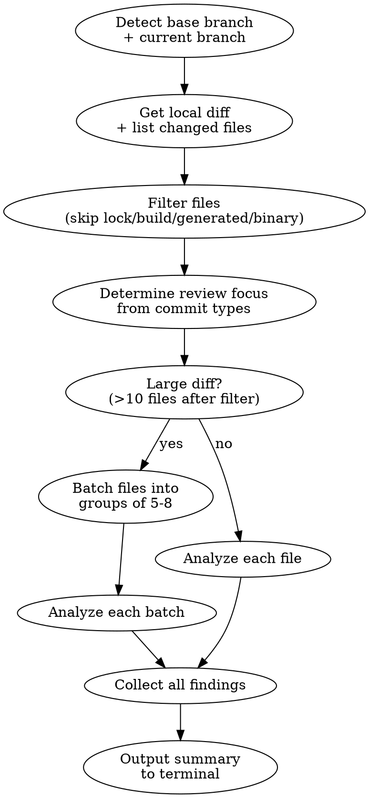

# Review Local Changes

Review local code changes (current branch vs base branch) with inline findings output to terminal. Reviews are **scope-based** — focus adapts based on commit types (fix, feat, refactor, etc.).

## Process



### Step 1: Detect Branches

```bash
# Current branch
git branch --show-current

# Base branch — find the merge base
# Try: main, master, develop (in order)
git merge-base HEAD main 2>/dev/null || git merge-base HEAD master 2>/dev/null || git merge-base HEAD develop
```

Determine the base branch by checking which of `main`, `master`, or `develop` exists. Use `git merge-base` to find the common ancestor for diffing.

If the user specifies a base branch, use that instead.

If the current branch IS main/master (no feature branch), review **unstaged + staged changes** instead:
```bash
git diff HEAD
```

### Step 2: Get Local Diff & Changed Files

```bash
# List changed files (names only)
git diff --name-only <MERGE_BASE>..HEAD

# Include uncommitted changes too
git diff --name-only <MERGE_BASE>

# Full diff
git diff <MERGE_BASE>

# Per-file diff (for large diffs)
git diff <MERGE_BASE> -- path/to/file.ext
```

**Also read commit messages** on the branch for context:
```bash
git log --oneline <MERGE_BASE>..HEAD
```

**Large diffs (>500 lines):** Don't try to read the entire diff at once. Instead:
1. List changed files first with `git diff --name-only`
2. Apply file filtering (Step 3) before reading diffs
3. Read diffs per file: `git diff <MERGE_BASE> -- <FILE>`

### Step 3: Filter Files (Token Optimization)

**Apply BEFORE reading any diffs.** Filter the file list from Step 2 to skip irrelevant files.

**Default skip patterns (always applied):**

| Category | Patterns |
|----------|----------|
| Lock files | `*.lock`, `package-lock.json`, `yarn.lock`, `pnpm-lock.yaml`, `Podfile.lock`, `Gemfile.lock` |
| Build/output | `build/`, `dist/`, `.dart_tool/`, `.next/`, `node_modules/` |
| Generated code | `*.g.dart`, `*.freezed.dart`, `*.generated.dart`, `*.gen.dart`, `*.mocks.dart` |
| Codegen output | `*.swagger.dart`, `*.openapi.dart`, `generated/`, `__generated__/` |
| Assets/binary | `*.png`, `*.jpg`, `*.gif`, `*.svg`, `*.ico`, `*.woff`, `*.ttf`, `*.eot` |
| IDE/config | `.idea/`, `.vscode/`, `*.iml` |
| Versioning | `pubspec.lock`, `*.sum`, `*.resolved` |
| Deletion-only files | Files with only deletions — nothing new to review |

**Per-repo overrides** from `.claude/review-config.yml` merge with defaults:
```yaml
review:
  ignore_patterns:          # Added to defaults
    - "*.freezed.dart"
    - "l10n/*.arb"
  include_patterns:         # Force-include despite defaults
    - "lib/generated/important_config.dart"
  extra_rules:              # Additional review criteria
    - "Prefer const constructors in Flutter widgets"
    - "Use sealed classes for state management"
```

**Implementation:** Filter file list before reading diffs:
```bash
# Get files with stat to identify deletion-only
git diff --stat <MERGE_BASE>
```
Then apply pattern matching to skip default + config patterns. Only read diffs for remaining files.

### Step 4: Determine Review Focus

Parse commit messages and apply scope-based review:

| Commit Type | Review Focus |
|-------------|-------------|
| `fix:` | Root cause solved? Regression risk? Edge cases? Test for the bug? |
| `feat:` | Design/architecture sound? Follows existing patterns? Breaking changes? |
| `refactor:` | Behavior preserved? Actually cleaner? No mixed-in feature changes? |
| `chore:` | Config correct? Security implications? |
| `test:` | Tests meaningful? Not testing implementation details? |
| `perf:` | Measurable? Tradeoffs acceptable? |

Mixed commit types: apply relevant focus per file.

### Step 5: Deep Analysis (CRITICAL — do NOT skip)

Shallow diff reading produces shallow reviews. **You MUST investigate the surrounding codebase** before forming opinions.

#### 5a: Trace all callers of modified functions

For every function whose **behavior changed** (not just new functions), use Grep to find all call sites.

**Why:** A function may have multiple callers. Changing behavior (e.g., removing a conditional, adding a side effect) affects ALL callers, not just the new code path.

**What to look for:**
- Does a caller already do something the modified function now also does? (double execution)
- Does any caller depend on the old behavior? (regression)
- Is the function called in a hot path where new side effects matter? (performance)

#### 5b: Read infrastructure/utility implementations

When the changes use a framework function, shared utility, or library call, **read its implementation** to understand:
- **Deduplication/conflict behavior**: Does it upsert or create duplicates? What's the unique key?
- **Error handling**: Does it raise, return error tuples, or silently fail?
- **Side effects**: Does it trigger callbacks, enqueue jobs, send notifications?

**Never assume** how a utility works — grep for its definition and read it.

#### 5c: Check for stale data in async/scheduled contexts

When code stores data in a payload consumed **later** (cron tasks, job queues, delayed messages):
1. Can the stored data change between creation and execution time?
2. Can other code paths modify the same data concurrently?
3. Should the worker read fresh data at execution time instead of using the stored value?

#### 5d: Verify edge cases in arithmetic/time calculations

When changes do arithmetic with values from external sources (APIs, user input, DB):
1. Can the input be nil/null/undefined?
2. Can the result be negative, zero, or unexpectedly large?
3. What are the boundary values?

Provide concrete guard suggestions, not just "add a nil check."

#### 5e: Check for orphaned/leaked resources

When changes create resources (scheduled tasks, background jobs, DB records):
1. Is the old resource cleaned up when a new one is created?
2. What happens if the lookup key changes between calls? (orphaned duplicates)
3. Is there a cleanup path when the feature is disabled/removed?

#### 5f: Verify error path continuity

For features that self-schedule (task creates next task):
1. What happens if execution fails? Does the chain break?
2. Is there a retry or re-schedule on error?
3. Will the feature silently stop working after one failure?

### Step 6: Analyze Changed Files

For each file that passed Step 3 filtering:
1. Read the diff hunks carefully
2. Apply deep analysis findings from Step 5
3. Identify issues based on review focus (Step 4) + any `extra_rules` from config

For **large diffs** (>10 files after filtering): batch files into groups of 5-8 and analyze each group separately to manage context. Collect all findings before composing the summary.

### Step 7: Compose Review Findings

**Every finding MUST include:**
1. **Severity badge** (Major/Minor/Nitpick)
2. **File and line reference** — `file_path:line_number`
3. **Clear description** — not just "this could be a problem" but exactly what goes wrong and under what conditions
4. **Evidence from codebase investigation** — reference the caller, the utility implementation, or the data flow you traced in Step 5
5. **Concrete fix suggestion** — provide actual code, not just "consider handling this"

**Bad finding (vague):**
> This value might be nil, which could cause issues.

**Good finding (specific + evidence + fix):**
> `expire_in` comes from the external API response. If the field is missing or nil, the arithmetic on line N crashes. Additionally, values smaller than the buffer (86400) would schedule in the past. Add a guard: `max((expire_in || 0) - 86400, 3600)`

**Bad finding (surface-level):**
> This changes behavior for all callers.

**Good finding (traced impact):**
> Removing the conditional means `save_token` now runs on every call. `TokenManager.refresh/2` (line N) already calls `save_token` after this function — so now it executes twice per refresh. This is likely idempotent, but the original guard may have existed for a reason. Was this intentional?

### Step 8: Output Summary to Terminal

Output the full review to the terminal using the format below. Do NOT create files, push, or interact with GitHub.

## Severity Levels

Only 3 severity levels:
- **Major** — bugs, security vulnerabilities, data loss, breaking changes
- **Minor** — design issues, missing error handling, potential regressions, readability
- **Nitpick** — style preferences, naming, minor suggestions, optional improvements

## Expected Actions per Severity

| Severity | Author Should | Expectation |
|----------|--------------|-------------|
| **Major** | **Must fix** before pushing | Blocks the branch |
| **Minor** | **Should fix** or explain why not | Prefer fix, but accept justification |
| **Nitpick** | **Optional** — fix if easy, skip if not | No action required, just awareness |

## Output Format

```markdown
## Local Review Summary

**Branch**: feature-branch -> main
**Type**: fix | feat | refactor | ...
**Files reviewed**: N | **Issues found**: N major, N minor, N nitpick

### Findings

1. **Major** `file.dart:42` — Brief description
   - *Evidence*: traced caller X which already does Y, causing double execution
   - *Suggestion*: `actual code fix here`

2. **Minor** `file.dart:15` — Brief description
   - *Evidence*: external API may omit field Z, causing crash
   - *Suggestion*: `guard clause here`

3. **Nitpick** `file.dart:8` — Brief description

### Positive Notes
- Good test coverage for edge cases
- Clean separation of concerns

### Recommendation
Ready to push | Minor changes needed | Significant changes needed

---
*Reviewed by Claude Code*
```

If no issues found:

```markdown
## Local Review Summary

LGTM! No issues found.

**Branch**: feature-branch -> main
**Files reviewed**: N
**Type**: feat

### Positive Notes
- Well-structured implementation
- Good test coverage

### Recommendation
Ready to push

---
*Reviewed by Claude Code*
```

## Common Mistakes

| Mistake | Fix |
|---------|-----|
| Reviewing without detecting base branch | Always find merge-base first |
| Missing uncommitted changes | Use `git diff <MERGE_BASE>` (not `..HEAD`) to include working tree |
| Reviewing generated files | Check `ignore_patterns` in repo config first |
| Shallow diff-only review | ALWAYS trace callers of modified functions and read utility implementations (Step 5) |
| Vague comments without evidence | Every finding must reference traced code: callers, implementations, data flows |
| Assuming utility/library behavior | Read the actual implementation — never guess dedup keys, error handling, etc. |
| Missing stale data in async contexts | When data is stored for later consumption, verify it won't be stale at execution time |
| No concrete fix suggestion | Provide actual code, not just "consider handling this" |
